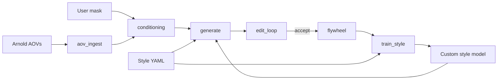

# neural_pass

Neural post-render pass that runs **after Arnold**. Condition AOVs plus a user mask feed a generative image model to produce a stylized drawing look. Styles are described by config files; each config maps to a post-trained / fine-tuned style model. Accepted finals become labeled training data — a flywheel that pulls the model closer to the project and user over time.

> **Status:** scaffold / frame only. Stages are stubs. No Arnold integration, no real model inference, no training implementation yet.

## Vision

1. **Arnold renders condition AOVs** — position, normal, depth, motion vector, and related buffers.
2. **User provides a mask** selecting where the neural pass should act.
3. **Conditioning pack** combines AOVs + mask into the model conditioning bundle.
4. **Style model** (selected via a style config) generates a stylized base image.
5. **Edit loop** — user iteratively modifies until satisfied.
6. **Accept** — final image is recorded as a labeled training sample (flywheel).
7. **Train style** — when enough accepted pairs exist (or on demand), post-train / fine-tune the base model into a project-specific style model described by that config.

### Flywheel

```
more use → more corrections → more accepted pairs → model closer to project/user → less editing
```

Each **style config** (`configs/styles/*.yaml`) describes one look. Customizing a style requires post-training / fine-tuning from a base model id into a customized style checkpoint. Generation and training both key off that same config.

## Pipeline diagram



## Stage wiring

| Order | Stage | Module | Role |
|------:|-------|--------|------|
| 1 | AOV ingest | `stages/aov_ingest.py` | Load/validate Arnold AOVs |
| 2 | Conditioning | `stages/conditioning.py` | Pack AOVs + mask → conditioning bundle |
| 3 | Generate | `stages/generate.py` | Call `StyleModel.generate` (stub) |
| 4 | Edit loop | `stages/edit_loop.py` | Load edit / compare / accept hooks |
| 5 | Flywheel | `stages/flywheel.py` | Record accepted labeled sample |
| — | Train style | `stages/train_style.py` | Post-train / fine-tune for a style config (separate CLI) |

Orchestrator: `pipeline.run_pass()` calls stages 1→5 in order. Training is intentionally separate (`scripts/train_style.py`) so generation and fine-tuning stay clear.

## Layout

```
neural_pass/
  README.md
  pyproject.toml
  docs/aov_requirements.md
  configs/styles/example_style.yaml
  data/{aovs,masks,generations,edits,accepted}/
  src/neural_pass/
    pipeline.py
    stages/…
    models/base.py          # StyleModel protocol
    io/{style_config,paths}.py
    gui/                    # mask editor (PySide6)
  scripts/{run_pass,train_style,mask_editor,make_sample_aovs}.py
```

## What's stubbed

- AOV loading/validation (returns placeholders / raises `NotImplementedError` where appropriate)
- Conditioning tensor construction
- Model load / generate / fine_tune
- Real edit-session UI or diff tools
- Dataset packaging and trainer loops
- Any Arnold plugin / DCC integration

Stubs print stage flow and return placeholders so a dry-run CLI works without claiming metrics or fake quality results.

## Quick start (dry-run)

From the repo root (after `pip install -e .` or with `PYTHONPATH=src`):

```bash
python scripts/run_pass.py \
  --style configs/styles/example_style.yaml \
  --aov-dir data/aovs \
  --mask data/masks/example_mask.png
```

Training entry (stub):

```bash
python scripts/train_style.py --style configs/styles/example_style.yaml
```


## Mask editor (GUI)

Basic PySide6 tool to inspect Arnold (or sample) AOVs and paint a float mask overlay.

See also: [`docs/aov_requirements.md`](docs/aov_requirements.md) for expected logical names (`position`, `normal`, `depth`, `motion_vector`).

### Install

```bash
python -m pip install -e ".[gui]"
# or without editable install:
python -m pip install PySide6 numpy imageio
```

OpenEXR is optional. If `pip install OpenEXR` fails on Windows, skip it — the loader still accepts `.tif` / `.tiff` / `.png` / `.npy` (and EXR when imageio FreeImage / OpenEXR is available).

### Sample AOVs (no Arnold)

```bash
python scripts/make_sample_aovs.py
```

Writes tiny buffers under `data/aovs/_sample/`.

### Run

```bash
# from repo root
set PYTHONPATH=src
python scripts/mask_editor.py --aov-dir data/aovs/_sample
```

Optional: `--mask path/to/mask.png`. Console script (after install): `neural-pass-mask-editor`.

Import check (no display required):

```bash
set PYTHONPATH=src
python -c "from neural_pass.gui.app import run; print('ok')"
```

### Shortcuts

| Key | Action |
|-----|--------|
| `Tab` | Next AOV buffer |
| `Shift+Tab` | Previous AOV buffer |
| `C` | Next channel within current AOV |
| `[` / `]` | Decrease / increase brush size |
| `B` | Brush mode |
| `E` | Eraser mode |
| `Ctrl+O` | Open AOV folder |
| `Ctrl+S` | Save mask (8-bit grayscale PNG) |
| LMB | Paint in current mode |
| RMB | Erase |

Mask values are float HxW in `[0, 1]` (start zeros). Display normalization does not alter underlying AOV arrays. Missing AOVs still allow loading what exists; a warning appears in the status bar.

## Style configs

See `configs/styles/example_style.yaml` for the schema: style description / prompt, base model id placeholder, and training hyperparameter placeholders. One file = one style; fine-tuning produces the customized model that `generate` will eventually load.
